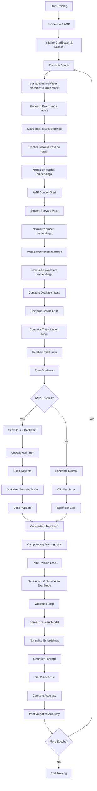

```mermaid
flowchart TD

    A[Start Training] --> B[Set device & AMP]
    B --> C[Initialize GradScaler & Losses]

    C --> D[For each Epoch]
    D --> E[Set student, projection, classifier to Train mode]

    E --> F[For each Batch: imgs, labels]
    F --> G[Move imgs, labels to device]

    G --> H[Teacher Forward Pass no grad]
    H --> I[Normalize teacher embeddings]

    I --> J[AMP Context Start]
    J --> K[Student Forward Pass]
    K --> L[Normalize student embeddings]

    L --> M[Project teacher embeddings]
    M --> N[Normalize projected embeddings]

    N --> O[Compute Distillation Loss]
    O --> P[Compute Cosine Loss]
    P --> Q[Compute Classification Loss]

    Q --> R[Combine Total Loss]

    R --> S[Zero Gradients]

    S --> T{AMP Enabled?}
    T -- Yes --> U[Scale loss + Backward]
    U --> V[Unscale optimizer]
    V --> W[Clip Gradients]
    W --> X[Optimizer Step via Scaler]
    X --> Y[Scaler Update]

    T -- No --> Z[Backward Normal]
    Z --> AA[Clip Gradients]
    AA --> AB[Optimizer Step]

    Y --> AC[Accumulate Total Loss]
    AB --> AC

    AC --> AD[Compute Avg Training Loss]
    AD --> AE[Print Training Loss]

    AE --> AF[Set student & classifier to Eval Mode]

    AF --> AG[Validation Loop]
    AG --> AH[Forward Student Model]
    AH --> AI[Normalize Embeddings]
    AI --> AJ[Classifier Forward]
    AJ --> AK[Get Predictions]

    AK --> AL[Compute Accuracy]
    AL --> AM[Print Validation Accuracy]

    AM --> AN{More Epochs?}
    AN -- Yes --> D
    AN -- No --> AO[End Training]
``` 
